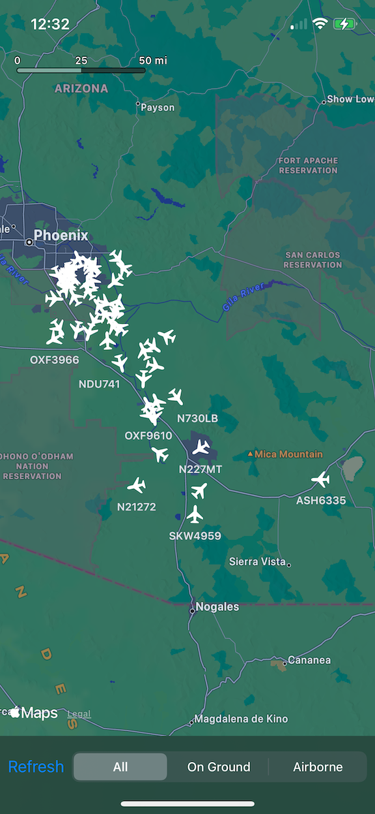
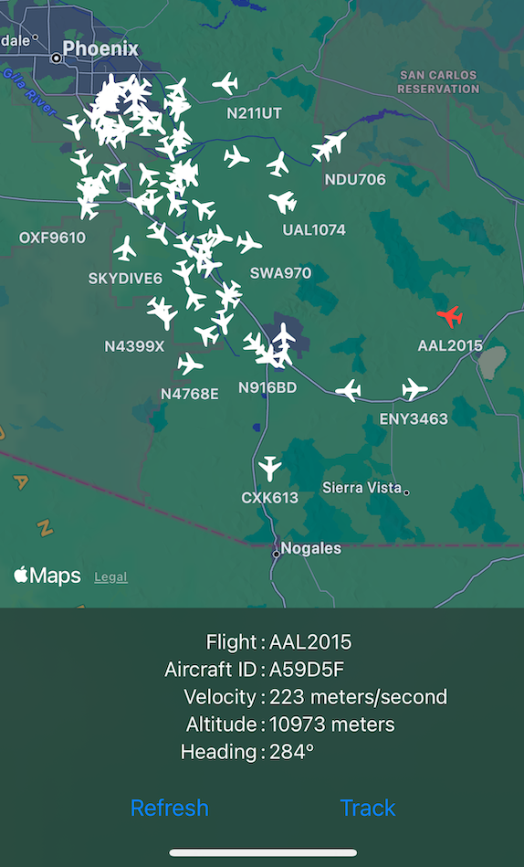
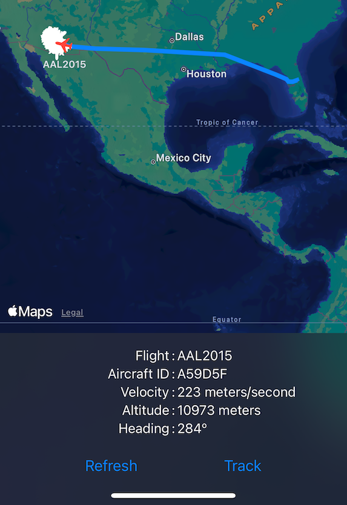
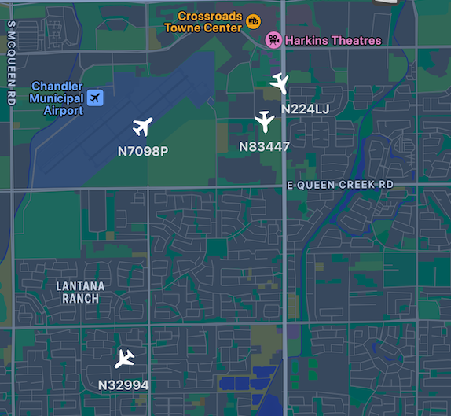

# OpenSkyFlightTracker

## Overview
This project contains a test or sample program for my [OpenSkyAPI](https://github.com/StateMachineJunkie/OpenSkyAPI) package. It demonstrates how to leverage said package to get flight information within a given region of a provided user-location and then display flight details and tracking for a selected flight.

For a detailed description of OpenSkyAPI and [OpenSky-Network](https://opensky-network.org), follow the link for the package.

### OpenSky-Network Account Required
Note that you will need a valid username and passsword for [OpenSky-Network.org](https://opensky-network.org). Visit the site and tap the `Register` button to be taken to the registration page. Without a valid account and credentials, most of this code will not work for you. Some of the API calls do not need authentication but most of the ones I use, do.

Once you have a valid set of credentails, update the `ProdNetwork.xcconfig` file with the username and password then you can successfuly compile and run the application.

## Apple Frameworks, Technology, and Techniques
This program and its associated package make use of the following Apple frameworks, technologies and techniques:

* [Concurrency](https://developer.apple.com/documentation/swift/concurrency) (async/await)
* [Core Location](https://developer.apple.com/documentation/corelocation)
* [Logger](https://developer.apple.com/documentation/os/logger)
* [Swift Packages](https://developer.apple.com/documentation/xcode/swift-packages)
* [Swift Package Resource Bundling](https://developer.apple.com/documentation/xcode/bundling-resources-with-a-swift-package)
* [MapKit for SwiftUI](https://developer.apple.com/documentation/mapkit/mapkit_for_swiftui), which was just released in September 2023.
* [URLProtocol](https://developer.apple.com/documentation/foundation/urlprotocol)
* [URLSession](https://developer.apple.com/documentation/foundation/urlsession)
* [Xcode Configuration Files](https://developer.apple.com/documentation/xcode/adding-a-build-configuration-file-to-your-project)
* [XCTest](https://developer.apple.com/documentation/xctest)

See the implementation of this program and its associated package for details.

## App Behavior and Usage
When the app first starts up it will display flights in a 200 square kilometer region around the current location of the device. While the app is busy a generic activity indicator will be displayed in the center of the view. At the bottom you will notice a small overlay containing a `Refresh` button and segmented buttons that allow you to filter the flight display. You may tap the `Refresh` button at any time in order to fetch updates from the network. New flights will be added, old ones will be removed, and existing filghts will be updated as regards position and altitude. You can also apply an **Airborn** or **On Ground** status filter to the diplayed flights. The default state is for no filter to be applied, which is indicated by **All**.

You can select a flight by tapping one of the plane icons on the map. Once selected, the plane will change to the selection color and, at the bottom of the map, you will see an overlay containing flight details.

Once you have a flight selected, a `TRACK` button will appear in the overlay. Tap it to show the tracking or location history for this flight by the OpenSky-Network.

In every view of the map, pinch/zoom is supported. I have not implemented [MapKit Annotation Clustering](https://developer.apple.com/documentation/mapkit/mkannotationview/decluttering_a_map_with_mapkit_annotation_clustering) for this sample. If this were a *real* app, I would do so but with a better design for the annotation to signify to the user that this icon represents a cluster of flights.

### Error Handling
Currently errors are logged to the console. If something is wrong or does not seem to be working, check there.

## TODO
* The `Refresh` and `Track` buttons should be mutually exclusive.
* I need to fix the flight selection bug which requires a user to deselect the current flight by tapping the map background before selecting another flight to monitor or track.
* Display any thrown errors to the user via popup.
* I am considering the addition of [MapKit Annotation Clustering](https://developer.apple.com/documentation/mapkit/mkannotationview/decluttering_a_map_with_mapkit_annotation_clustering). But it is not really necessary for this sample app and I'm trying to avoid gold-plating.

## License
OpenSkyFlightTracker is released under an MIT license. See [LICENSE](https://github.com/StateMachineJunkie/OpenSkyFlightTracker/blob/main/LICENSE) for more information.
